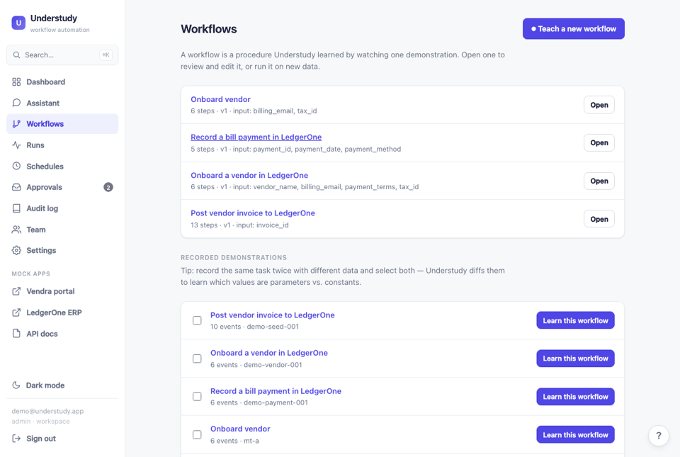
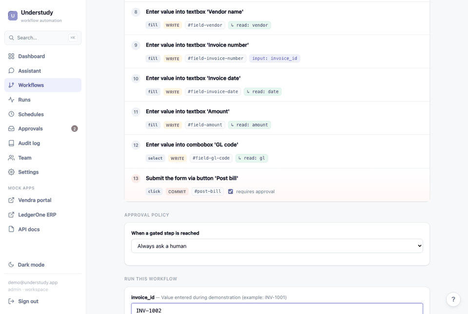
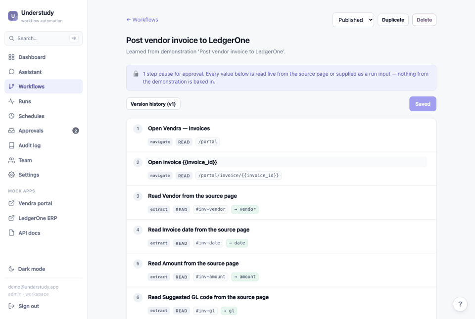
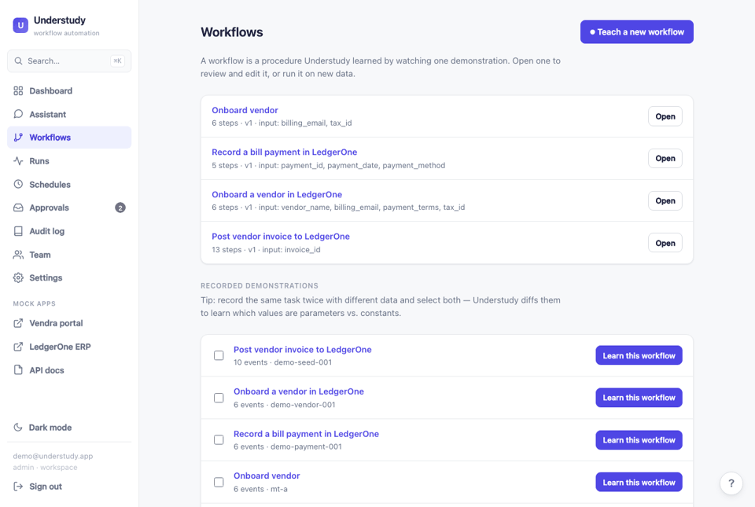
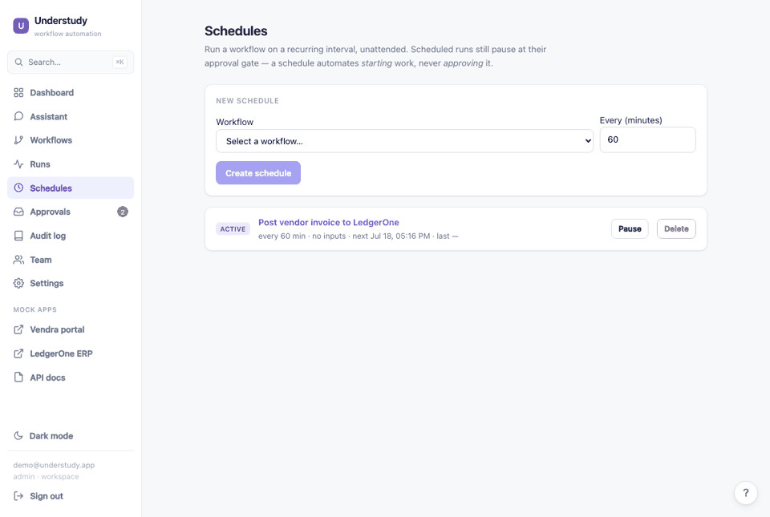
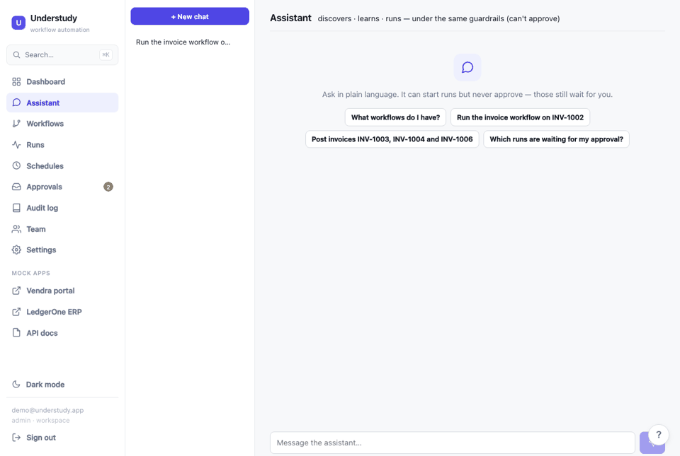
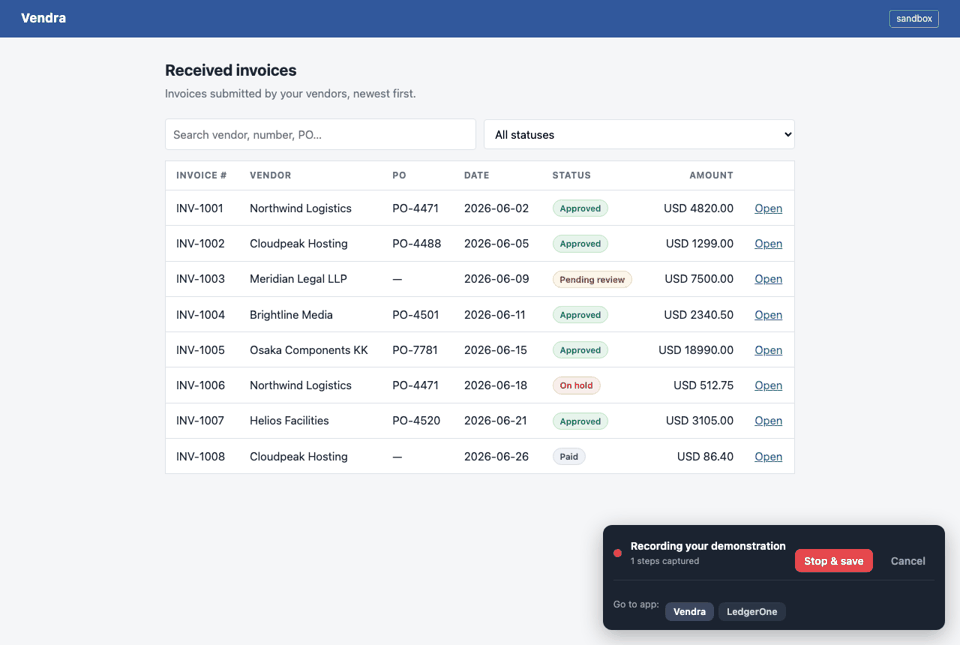
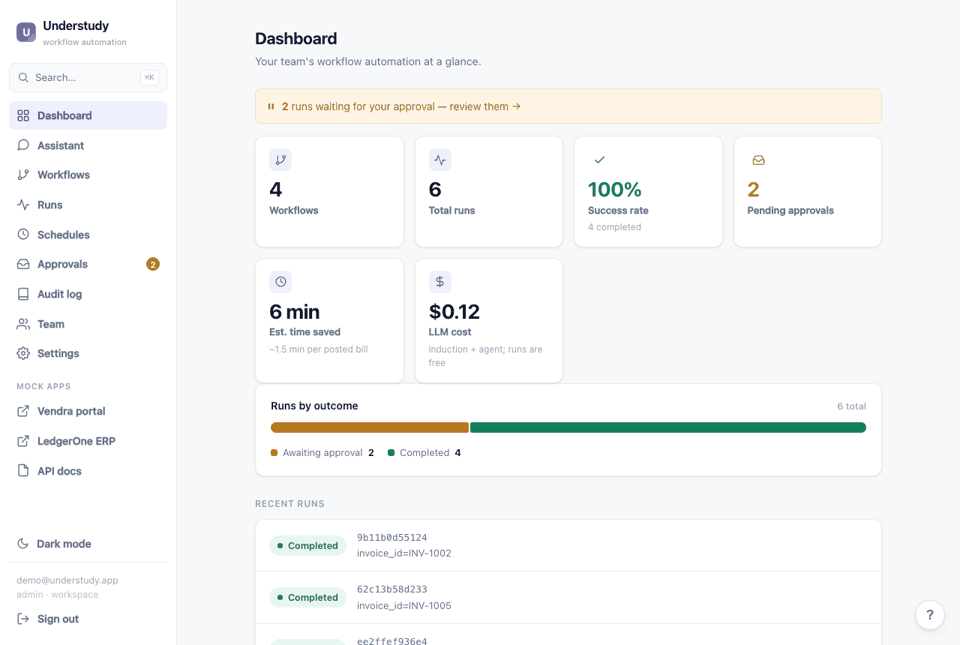

# Understudy

**An AI teammate that learns a browser workflow by watching you do it once, then runs it for you — under policy, with a human approval gate before anything irreversible, and a full audit trail.**

Built for the *"learn a user's process by watching them, then do it for them"* problem, scoped to the workflow finance-operations teams actually drown in: moving data between systems that don't talk to each other — an invoice portal (**Vendra**) into an ERP (**LedgerOne**).

> **Setup:** `make dev` (Docker) → http://localhost:5173, or `make install && make dev-native` → http://localhost:8000. The app seeds a demo account + three workflows on boot.
> **Decisions log:** [`decisions.md`](decisions.md) — the real calls, alternatives, and trade-offs (start here to see how I think).

---

## Table of contents
- [The demo in one paragraph](#the-demo-in-one-paragraph)
- [Feature demos](#feature-demos)
- [What it does](#what-it-does)
- [Why this scoping](#why-this-scoping)
- [Quick start](#quick-start)
- [How to use it](#how-to-use-it)
- [Architecture (HLD)](#architecture-hld)
- [Low-level design (LLD)](#low-level-design-lld)
- [Proof it works](#proof-it-works)
- [The hard part I went deep on](#the-hard-part-i-went-deep-on)
- [Deployment](#deployment)
- [Scope — what it is and isn't](#scope--what-it-is-and-isnt)
- [What I'd build next](#what-id-build-next)
- [Repository map](#repository-map)

## What it does

A multi-tenant full-stack product, not a script:

- **Learn by watching** — record a demonstration; induction produces a legible, editable, parameterized workflow spec (deterministic core + optional LLM legibility pass).
- **Learn from a second example** — record the same task twice with different data and **multi-trace diffing** knows which values are parameters (they vary) vs. literals (constant), instead of guessing from one recording.
- **Run on new data** — give it only an `invoice_id`; every other value is read live off the page. Self-healing locators (test-id → role+name → css → **LLM fallback**) survive page redesigns, and each hop is reported.
- **Preview before you trust it** — a **dry run** executes up to the approval gate (reads live values, fills the form) and stops, committing nothing; a **drift pre-flight** checks every target still resolves on the live pages before a run.
- **Policy-governed approvals** — per-workflow policy auto-posts small invoices and escalates the rest to a **human approval inbox**; irreversible steps are gated by construction.
- **Run unattended** — **schedule** a workflow on a recurring interval; scheduled runs fire on their own but still pause at the approval gate (a schedule automates *starting* work, never *approving* it).
- **Conversational agent** — a chat assistant (Claude Sonnet, with a keyless deterministic fallback) that discovers, learns, and runs workflows through the *same org-scoped, gated tools* the UI uses. It can start work but has **no approve tool** — releasing a gate stays human-only, by construction. A ⌘K command palette reaches any workflow, action, or page.
- **Batch & scale** — run a workflow over a list of invoices through a bounded worker pool.
- **Workflow lifecycle** — draft / published / archived, full version history with one-click rollback, duplicate, delete.
- **Dashboard & observability** — KPIs (success rate, pending approvals, time saved, LLM cost), a **live screenshot view** of the agent working, per-run audit trail, run retry, and cost metering.
- **Accounts & tenancy** — bcrypt + JWT auth, org-scoped data isolation, rate limiting. A one-click demo keeps it frictionless to try.

---

## The demo in one paragraph

A user demonstrates once: open the **Vendra** portal, open invoice INV-1001, read its fields, switch to the **LedgerOne** ERP, enter the bill, click *Post bill*. Understudy records **semantic events** (roles, labels, test-ids — never pixel coordinates), induces a **human-readable, parameterized workflow spec**, and can then run that procedure on invoices it has never seen. A run is given **only an invoice id** — vendor, date, amount and GL code are *read live* off each invoice's own page by learned `extract` steps. Because *Post bill* commits state, the induced spec flags it `requires_approval`; every replay **hard-pauses** there until a human approves, and every action lands in an audit log with actor identity (`agent` / `human`) and timestamp.

## Feature demos

> Short clips of each capability. All captured from the running app via `python scripts/capture_demos.py`.
> For the full guided tour, see the **2-minute narrated walkthrough** https://github.com/user-attachments/assets/86cc36f6-5f5e-4864-a377-7b66a558c7fc and the step-by-step [How to use it](#how-to-use-it) guide.

**Run on new data → gate → approve → posted.** Given only an invoice id, the run reads vendor/amount/GL live, hard-pauses at the *Post bill* gate, and posts only after a human approves.


**Learn a legible, parameterized workflow.** One demonstration becomes an editable spec — each step's intent, its `{{parameter}}`/`{{extract.*}}` values, and the gated commit.



<table>
<tr>
<td width="50%"><b>Dry run / preview</b> — run up to the gate, read live values, commit nothing.<br></td>
<td width="50%"><b>Drift pre-flight</b> — check every target still resolves on the live pages before a run.<br></td>
</tr>
<tr>
<td><b>Multi-trace learning</b> — diff two recordings to tell parameters from constants.<br></td>
<td><b>Scheduling</b> — run a workflow unattended on an interval, still gated.<br></td>
</tr>
<tr>
<td><b>Conversational agent</b> — discovers/runs workflows through the same gated tools; can't approve.<br></td>
<td><b>In-browser recorder</b> — teach by doing; switch apps mid-recording from the recorder bar.<br></td>
</tr>
<tr>
<td colspan="2"><b>⌘K command palette + dark mode</b> — keyboard-first navigation to any workflow, action, or page.<br></td>
</tr>
</table>

## Why this scoping

- **Semantic traces, not macros.** RPA-style click recording breaks the moment a page changes. Understudy captures each action as *role + accessible name + data-testid + CSS fallback*, and the executor resolves targets through that chain at replay time (`testid → role+name → css`), reporting when it "healed" via a fallback. There's a test that removes every test-id from the ERP and the workflow still posts the right bill.
- **The learned artifact is legible and editable.** The workflow spec is plain JSON: every step carries a one-sentence `intent`, values reference `{{parameters}}` or `{{extract.*}}` outputs, and risky steps carry `requires_approval`. A finance reviewer can audit the procedure; the UI renders it as an editable list. Trust in the artifact *is* the product.
- **Deterministic first, LLM second.** A heuristic inducer produces a structurally-valid spec offline (testable, reproducible, key-free). An LLM enrichment pass improves naming and — its unique contribution — **provenance**: linking typed values back to the page they were read from, turning them into live `extract` steps. Enrichment is validated against hard invariants (may never remove an approval gate, may never invent selectors) and falls back to the heuristic spec on any violation. The model is called **once per workflow learned (~$0.06)**; every subsequent run is 100% deterministic and costs nothing.
- **Irreversible actions are gated by construction.** `risk: commit` without `requires_approval: true` fails spec validation — at the edit boundary too, so you can't save an ungated commit through the API.

## Quick start

**Docker (recommended)** — full stack with live reload, no local Python/Node needed:

```bash
cp .env.example .env     # optional: add ANTHROPIC_API_KEY to unlock the LLM + agent
make dev                 # build + start backend (:8000) and frontend (:5173)
```

Open **http://localhost:5173** and click **"Try the live demo"** (or register your own workspace).

**Native (no Docker):**

```bash
make install             # venv + backend deps + Chromium + build the React panel
make dev-native          # API + built UI on http://localhost:8000
```

Without an `ANTHROPIC_API_KEY`, induction uses the deterministic heuristic and the agent uses a keyless fallback — identical safety behaviour, plainer wording.

```bash
make test          # 147 tests, incl. the real-Chromium e2e + robustness/policy/tenancy suites
make ci            # ruff + mypy + import-linter + tests (what CI runs)
make eval          # success-rate harness across all invoices + a failure case
make down          # stop the docker stack   (make nuke also drops its volumes)
```

## How to use it

> **Prefer to watch?** A 2-minute narrated, cursor-guided walkthrough covering every step below is at 
https://github.com/user-attachments/assets/2580da9e-2072-400d-8c8b-4509261dca14


Everything below works out of the box on the [live demo](https://understudy-hurg.onrender.com) or a local `make dev` — the app ships a seeded demo account and example workflows, so you can start on step 2.

### 1. Get in
Open the app and click **"Try the live demo"** (no signup), or **Create an account** for your own isolated workspace. You land on the **Dashboard**.

### 2. Run a workflow on new data — the core loop
1. Sidebar → **Workflows** → open **"Post Vendor Invoice from Vendra to LedgerOne"**.
2. In the run box, type an invoice it has never seen — e.g. **`INV-1005`** — and click **Run once**.
3. Watch the **live view**: it opens the Vendra portal, reads the vendor / amount / GL code, switches to the LedgerOne ERP, and fills the bill — you supplied *only* the id.
4. It **hard-pauses at "Post bill"** (the irreversible step). Click **Approve** to post, or **Reject** to stop — nothing is written to the ERP on reject.
5. Find the finished run under **Runs**, with a step-by-step **audit trail** (`agent` vs `human`, timestamps).

> Try any of **INV-1001 … INV-1008** — only the invoice id changes; every other field is read live off that invoice's own page.

### 3. Teach it a brand-new workflow — learn by watching
1. **Workflows → ⏺ Teach a new workflow → Start recording in Vendra.** A red **"Recording your demonstration"** bar appears.
2. **Do the task once, cleanly:** open an invoice (e.g. `INV-1001`), then use the recorder bar's **Go to app → LedgerOne**, click **Enter new bill**, type the values you just read, and click **Post bill**.
3. Click **Stop & save** — you return to Workflows with your new recording listed.
4. Click **Learn this workflow** on that recording. Understudy induces a runnable, parameterized spec and **auto-gates** the Post step.
5. **Make it robust:** record the *same* task a second time with a *different* invoice, tick **both** recordings, and click **"Learn from 2 recordings"** — it diffs them to tell **parameters** (values that varied) from **constants**.

Then run it exactly as in step 2.

### 4. Review & edit what it learned
Open any workflow to see the spec as a **readable step list** — each step's plain-English intent, its `{{parameter}}` / `{{extract.*}}` values, and the gated commit. Edit inline; the API **refuses to save an ungated commit step**. Every save is **versioned** (one-click rollback), and you can duplicate, archive, or delete.

### 5. Preview before you trust a run
On a workflow page:
- **Dry run** — reads live values and fills the entire form **up to the gate, committing nothing**.
- **Check target health** (drift pre-flight) — verifies every element the workflow depends on still resolves on the live pages, so you catch a redesigned portal *before* it breaks a run.

### 6. Approve or reject at the gate
Runs that reach a commit gate wait in **Approvals** (the sidebar badge shows how many). Open one to see exactly what it's about to do, then **Approve** or **Reject**. Small invoices can **auto-post by policy**; everything else escalates here. The conversational agent can *start* runs but has **no approve tool** — releasing a gate is always human.

### 7. Run unattended or in bulk
- **Schedules** — pick a workflow and an interval; it fires on its own but still **pauses at the gate**.
- **Batch** — run a workflow over a list of invoices at once, through a bounded worker pool.

### 8. Ask the assistant
Open **Assistant** (or press **⌘K → "assistant"**) and ask in plain English — e.g. *"Which of my workflows need approval?"* or *"Run the invoice workflow for INV-1006."* It drives the **same org-scoped, gated tools** as the UI.

### Getting around
**Dashboard** (KPIs + live view) · **Workflows** · **Runs** (history + audit) · **Approvals** (inbox) · **Schedules** · **Audit log** · **Team** · **Settings**. Press **⌘K** anywhere for the command palette; toggle **dark mode** from the sidebar.

## Architecture (HLD)

One FastAPI service hosts everything — the API, the built React panel (same-origin, no CORS), and two deterministic mock finance apps that stand in for real portals so the demo never depends on a third-party site.

```
                        ┌─────────────────── demonstration ───────────────────┐
   user drives  ──────► │ Playwright browser + inject.js  (semantic capture)   │
   a task once          └──────────────────────────┬───────────────────────────┘
                                                    │  Trace  (semantic events, JSON)
                                                    ▼
                        ┌──────────────── induction ───────────────┐
                        │  heuristic baseline ──► LLM enrichment    │  intents, params,
                        │  (deterministic)        (legibility only) │  provenance/extract
                        └──────────────────────────┬────────────────┘
                                                    │  WorkflowSpec (JSON IR — editable)
                                                    ▼
                        ┌──────────────── execution ────────────────┐
                        │  Runner ──► ActionSink                     │  approval gates,
                        │            ├─ PlaywrightSink (self-healing)│  audit log w/ actor
                        │            └─ FakeSink (tests)             │
                        └──────────────────────────┬────────────────┘
                                                    │  Run + RunEvents (SSE, persisted)
                                                    ▼
   auth (bcrypt+JWT, org-scoped)  ·  approval policy engine  ·  bounded worker pool
   FastAPI  ──  /api (auth · traces · workflows · runs · batch · dashboard · usage +SSE)
   React panel (dashboard · spec editor · runs · approval inbox · settings)  ·  /portal /erp
   Persistence ──  SQLAlchemy + Alembic  (SQLite default · Postgres via DATABASE_URL)
```

Every data endpoint is behind auth and scoped to the caller's org. **Request flow — learn → run:** record (or seed) a trace → `POST /traces/{id}/induce` produces a `WorkflowSpec` → review/edit it in the panel (`PUT` validates it, `POST /status`, versions/rollback) → `POST /workflows/{id}/runs` (or `/batch`) launches a headless Chromium through the worker pool that walks the spec, streaming its audit log + live screenshots over SSE → at the commit gate the **approval policy** either auto-approves (small amounts, logged as `policy`) or escalates to the human inbox → the bill posts and the run is persisted to history.

## Low-level design (LLD)

**Backend module map** (`backend/app/`) — a layered architecture (dependencies point downward; enforced in CI by `import-linter`):

```
api/          Controllers — thin FastAPI routers (one file per resource), deps.py (DI), schemas.py (request DTOs)
  ↓
services/     Use-cases — orchestration (induction, runs, agent chat, metrics). HTTP-agnostic; raise domain errors.
  ↓
repos/        Repositories — org-scoped persistence, one class per aggregate. The only layer that touches the ORM.
  ↓
domain/       Pure domain models — Trace + WorkflowSpec (steps, params, validate_references). No outward imports.

clients/      I/O seam to the Anthropic API (single place the SDK is built)      prompts/   versioned system prompts
engine/       Runner (policy gates, live frames, audit), self-healing PlaywrightSink, RunManager (bounded worker pool)
agents/       the conversational agent's tool-use loop (tools are the same gated use-cases — no approve tool)
induction/    heuristic.py (deterministic inducer) + llm.py (legibility pass behind hard invariants)
db/           SQLAlchemy models (document-per-row), session, Alembic migrations (run on boot)
core*         config.py (pydantic-settings), container.py (composition root), auth.py (bcrypt+JWT, org=tenant), ratelimit.py
recorder/     inject.js capture (accessible-name, passwords never recorded) + the Playwright demonstration session
mockapps/     Vendra + LedgerOne — deterministic, stable test-ids, ?resilience=drop-testids variant for the self-healing test
```
<sub>*cross-cutting modules live at the package root (`config.py`, `container.py`, `auth.py`, `ratelimit.py`, `main.py`).</sub>

**Layered-architecture rules, CI-enforced.** `import-linter` (see `pyproject.toml`) fails the build if `domain/` ever imports an outer layer, or if a controller/service is imported *upward* (repos importing services, etc.). The dependency direction is a contract, not a convention.

**Frontend module map** (`frontend/src/`)

```
routes/       one file per screen: Dashboard, Workflows, Workflow (spec editor), Run (+ live view),
              Runs, Approvals, Audit, Team, Assistant, Settings, Login
components/    shared UI: CommandPalette (⌘K), Tour (guided onboarding), Skeleton (loaders), Icon
lib/          api/ (typed client — types.ts · http.ts · resources/{auth,traces,workflows,runs,metrics,agent}.ts)
              and auth.tsx (the auth context)
hooks/        useAsync — one hook for fetch/loading/error/reload, replacing per-page boilerplate
styles/       the hand-written CSS design system (light + dark via data-theme tokens)
```

**The workflow IR** — a step's `value` may be a literal, a `{{run_input}}`, or a `{{extract.key}}` (data read live during the run). `validate_references()` catches the three bugs that silently break replays: an undeclared parameter, an `extract` referenced before it's produced, and a `commit` step without a gate.

**Self-healing locator chain** — `PlaywrightSink._locate` tries `data-testid`, then ARIA `role`+accessible-name, then a CSS fallback, and reports which strategy resolved so the audit log can show `healed via role+name`.

**Persistence** — three aggregates (trace, workflow, run) are document-shaped, so each is one row storing the domain model as a JSON payload plus extracted, indexed columns (status, workflow_id, timestamps) for the queries the UI runs. SQLite by default (zero-ops); set `DATABASE_URL` to a `postgres://` URL for Postgres — the repository layer is the only code that touches the ORM.

## Proof it works

**147 tests** (`make test`), ~89% line coverage — meaningful, targeting the properties that matter:

| Suite | What it locks down |
|---|---|
| `test_e2e` | Real headless Chromium learns from INV-1001 and posts **INV-1005** (unseen), gate held, ERP row asserted field-for-field. This one test *is* the product. |
| `test_executor` | Gate hard-pauses; rejection stops before commit (even if it arrives *before* the gate); a **dry run** previews up to the gate and commits nothing; **drift pre-flight** flags a moved target; `{{extract}}` feeds later fills; an unresolved ref fails the run instead of typing `{{amount}}`. |
| `test_multitrace` / `test_scheduling` | Diffing two recordings promotes/demotes params vs. literals; the scheduler's due→fire→re-arm tick, org-scoping, and skip-a-deleted-workflow path. |
| `test_policy` | Auto-approves below threshold (actor=policy); escalates at/above; unparseable amount → human; default always asks; **policy can't remove a commit gate**; awaiting state is persisted (inbox correctness). |
| `test_robustness` | Self-heals when test-ids are removed; unknown invoice fails safely (no post, never gates); mid-run throw settles FAILED without committing; concurrent runs isolated; SSE replays full history to a late subscriber. |
| `test_auth` / `test_batch` | Register/login/me; **HTTP tenant isolation** (org B can't see org A's data); batch fans out one governed run per value; the worker pool bounds concurrency. |
| `test_induction` / `_llm` | Parameterizes to `invoice_id` only; no demo literals leak into steps; enrichment never removes a gate or invents selectors. |
| `test_persistence` | Org-scoped repos round-trip faithfully; version history + rollback; run history survives a server restart; usage/replay/conversation isolation. |
| `test_mockapps` / `test_api` | Auth-gating; PUT refuses an ungated commit (422); lifecycle status/duplicate/delete; versions + rollback; enriched invoice fields + payment lifecycle. |
| `test_services` / `test_config` | Service use-cases + their domain-error paths, tested without the web stack; central Settings resolution (env, model split, derived flags). |

**Eval harness** (`make eval`) — runs the learned workflow across all seeded invoices, checking each posted bill against the portal's source of truth, plus a failure-mode case:

```
invoice    result detail
INV-1001…INV-1008   PASS   ok        (each: only invoice_id supplied; rest read live)
INV-9999            SAFE   failed safely, nothing posted
------------------------------------------------------------
success rate: 8/8 (100%)  | bad-invoice degrades safely: yes
```

CI (`.github/workflows/ci.yml`) gates every push on ruff + mypy + pytest (with a real Chromium) and a frontend typecheck+build.

## The hard part I went deep on

**Learning the *procedure*, and making a replay that survives the real world.** The easy version records clicks and replays coordinates; it breaks the first time a page shifts. Understudy instead (1) captures semantics, (2) separates *what varies per run* (a single `invoice_id`) from *what's constant*, reading everything else live off the page via provenance-derived `extract` steps, and (3) resolves every target through a self-healing chain. The payoff is tested directly: the ERP form is served **with every `data-testid` stripped** and the learned workflow still posts the correct bill by falling back to accessible role+name — and says so in the audit log. Around that, the safety core is enforced *structurally*: a `commit` step can't be saved without a gate, the gate has no timeout bypass, and unresolved values fail the run rather than typing a template literal into an ERP field.

## Deployment

Single container: a multi-stage `Dockerfile` builds the React panel (node) then serves API + panel + mock apps from the Playwright Python image (Chromium + system deps preinstalled — avoids the usual headless-Chromium failures on PaaS). The app **seeds itself on boot** (offline, no key needed) so a fresh deploy is demoable immediately.

**Render (one click):** push to GitHub → New → Blueprint → point at the repo (`render.yaml`). It generates `UNDERSTUDY_JWT_SECRET`; optionally set `ANTHROPIC_API_KEY`. SQLite lives on the container's ephemeral disk (resets on redeploy — fine for a demo); for durability, mount a Render Disk at `/srv/data` or set `DATABASE_URL` to a managed Postgres.

## Scope — what it is and isn't

**Is:** a multi-tenant full-stack product — auth + org isolation, a legible editable IR, deterministic self-healing replay, policy-governed non-bypassable approval gates with a human inbox, batch runs on a bounded pool, a dashboard with live view + cost metering, workflow versioning, an audit trail, real persistence, CI, and a hosted demo.

**Deliberately out of scope** (with reasons in [`decisions.md`](decisions.md)): real third-party sites (SSO, 2FA, CAPTCHA), credential handling, multi-site generalization from a single trace, and a Chrome-extension recorder (the capture script is extension-portable, but store review doesn't fit the timeline; the Playwright demonstration browser is the primary recorder). `contenteditable`, drag-drop, and file uploads in the recorder are known gaps.

## What I'd build next

- **Approval-policy learning loop** — repeated manual approvals of similar invoices become a *suggested* per-vendor / per-GL rule, keeping the tighten-only safety property (today's policy is amount-threshold only).
- **Data-driven triggers** — beyond the interval scheduler, fire a workflow when new work appears (e.g. a new *Approved* invoice in the portal), not just on a clock.
- **Durable, scaled execution** — a persistent run queue and browser-pool workers across nodes (the in-process bounded pool is the current single-node boundary); Postgres is already wired, just not the default.
- **Correct-and-reteach** — fix a mis-learned step from a run and fold the correction back into the workflow (human-in-the-loop learning).

## Repository map

```
backend/app/
  api/        controllers — routers/ (per resource), deps.py (DI), schemas.py (request DTOs)
  services/   use-cases (induction, runs, agent, metrics, workflows, scheduling) + domain errors
  repos/      org-scoped repositories (one class per aggregate)
  domain/     Trace + WorkflowSpec + ApprovalPolicy — the pure IR (start here)
  clients/    Anthropic LLM seam (+ locator fallback)   prompts/   system prompts
  engine/     Runner (policy gates, dry-run, live frames), self-healing PlaywrightSink + drift pre-flight, RunManager (worker pool, scheduler)
  agents/     the conversational agent's tool-use loop
  induction/  heuristic baseline + multi-trace diffing + LLM enrichment (+ cost pricing)
  db/         ORM rows, session, migrations       recorder/  inject.js capture + Playwright session
  mockapps/   Vendra + LedgerOne (deterministic demo stage)
  config.py · container.py · auth.py · ratelimit.py · main.py   (cross-cutting + composition root)
frontend/src/ routes/ · components/ · lib/(api,auth) · hooks/ · styles/
tests/        e2e · executor · policy · robustness · auth · batch · induction · multitrace · scheduling · persistence · api · mockapps · services · config
docker-compose.yml · Makefile · Dockerfile(.dev) · render.yaml · scripts/(seed_demo, eval)
samples/      example-trace.json + example-workflow.json — the data model, exported (see samples/README.md)
decisions.md  the running decision log
```

## Tech stack

Python 3.11+ · FastAPI · SQLAlchemy 2.0 · Alembic · Pydantic v2 + pydantic-settings · bcrypt + PyJWT + slowapi · Playwright (Chromium) · Anthropic (Claude — Sonnet for the agent, Opus for induction) · React 18 + Vite + TypeScript · ruff + mypy + import-linter + pytest · Docker + docker-compose.
